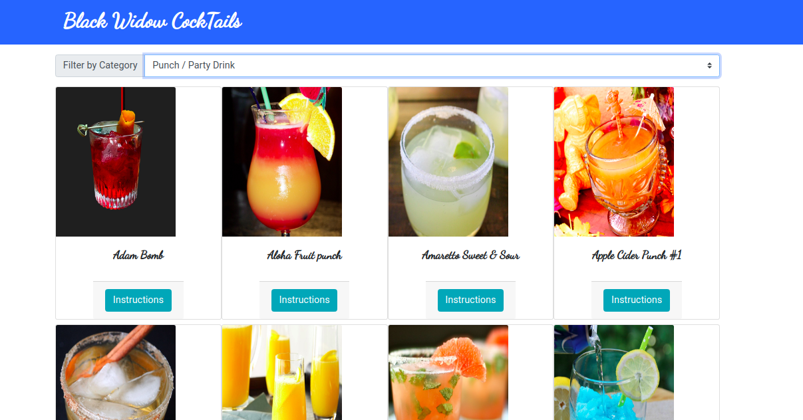
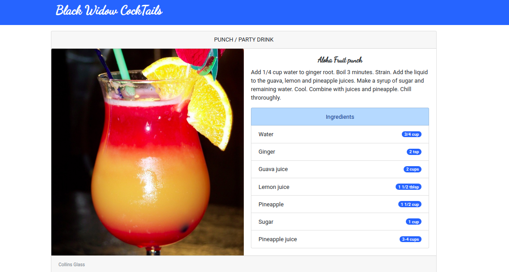

[![Contributor][contributor-shield]][contributor-url]
[![Issues][issues-shield]][issues-url]
<br />

<p align="center">
  <h1 align="center">Black Widow CockTails App </h1>
  <p align="center">
    React/Redux
    <br />
    <a href="https://github.com/bafiam/Bafiam-Cocktails.git"><strong>Explore the docs »</strong></a>
    <br />
    <br />
    ·
    <a href="https://github.com/bafiam/Bafiam-Cocktails/issues">Report Bug</a>
    ·
    <a href="https://github.com/bafiam/Bafiam-Cocktails/issues">Request Feature</a>
  </p>
</p>

<!-- TABLE OF CONTENTS -->

## Table of Contents

- [About the Project](#about-the-project)
- [Screenshots](#screenshots)
- [Prerequisites Installations](#prerequisites-installations)
- [Technology used](#technology-used)
- [Usage/Getting Started](#how-to-Use)
- [Live Version](#live-version)
- [Roadmap](#roadmap)
- [License](#license)
- [Authors](#authors)

<!-- ABOUT THE PROJECT -->

## About The Project

This project is a Cocktail App built with React and Redux. It implements the functionality of building components in React and connecting the components to fetch data from an API then uses the Redux store using Redux actions, reducers, and methods.

In this project, the complete feature of the app renders the following:

- A list of cocktails from different categories
- A filter of the cocktails based on the category
- View a single drink
- View the drink Ingredients
- View instructions on how to mix the Ingredients

Detailed project description can be found here [Catalogue of Statistics](https://www.notion.so/Catalogue-of-Statistics-72446e7fa33c403a9b6a0bc1de5c6cf5)

## Screenshots

#### Home



#### Single Item



## Prerequisites Installations

<p>If you want a copy of this project running on your machine you have to install:</p>

- <a href="https://nodejs.org/en/">Node.js (v5. 2.0 or greater)</a>
- <a href="https://git-scm.com/downloads">Git version control system</a>

## Technology used

- Node.js
- React
- React-DOM
- React-Create-App
- Redux
- npm
- CSS
- ES6
- React-thunk

## Usage/Getting Started

Once you have installed the required package shown on the [Prerequisites Installations](#required-installations), proceed with the following steps

Clone the Repository,

```Shell
your@pc:~$ git clone https://github.com/bafiam/Bafiam-Cocktails
```

Move into the cloned folder

```Shell
your@pc:~$ cd Bafiam-Cocktails
```

Get the dependencies needed for the app

```Shell
your@pc:~$ npm install
```

Start the server and use the app

```Shell
your@pc:~$ npm run start
```

## Live Version

This is the link to the live preview. Feel free to visit.<br>
[Black Widow CockTails](https://vibrant-jennings-158558.netlify.app/)<br>

<!-- ROADMAP -->

## Roadmap

See the [open issues](https://github.com/bafiam/Bafiam-Cocktails/issues) for a list of proposed features (and known issues).

<!-- CONTACT -->

## Authors

Stephen Gumba

- [GitHub profile](https://github.com/bafiam)

<!-- MARKDOWN LINKS & IMAGES -->
<!-- https://www.markdownguide.org/basic-syntax/#reference-style-links -->

[contributor-shield]: https://img.shields.io/badge/Contributors-1-%2300ff00
[contributor-url]: https://github.com/bafiam/Bafiam-Cocktails/graphs/contributors
[issues-shield]: https://img.shields.io/badge/issues-0-%2300ff00
[issues-url]: https://github.com/bafiam/Bafiam-Cocktails/issues/
